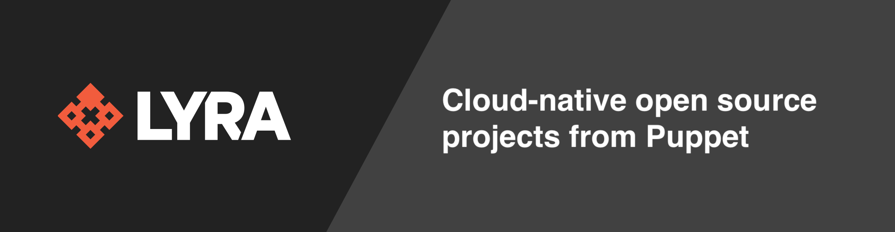

# What is Lyra?
Lyra (“lee-ruh”) is an open source workflow engine for provisioning and managing cloud native infrastructure. Using infrastructure as code, Lyra enables you to declaratively provision and manage public cloud, private cloud, and other API-backed resources as well as orchestrate imperative actions. For more information, see the [README.md](https://github.com/lyraproj/lyra) in the main project repository.

# Getting started

If you're using homebrew, you can use:

```
brew install lyraproj/lyra/lyra
```

We'll have RPMs and other package formats available soon; for now on other platforms, follow the [build instructions](https://github.com/lyraproj/lyra#build) in the README.

Check out the [example workflows](https://github.com/lyraproj/lyra/tree/master/workflows) to get an idea of what Lyra can do. In particular the ["foobernetes.yaml"](https://github.com/lyraproj/lyra/blob/master/workflows/foobernetes.yaml) has a heavily annotated workflow that describes the deployment of infrastructure to a simple Kubernetes-like service.

# Lyra compared to $tool

There are a number of similar projects and products in this space. The following comparisons are not meant to judge the relative merits of Lyra against them, but rather to provide a frame of reference for users who might be familiar with one or more of them.

## Lyra compared to Terraform

- *Language:* Terraform is tied to HCL (Hashi Config Language), whereas Lyra has a _polyglot_ (multiple language) design. Currently supported language frontends for Lyra are YAML, Typescript, and a variant of the Puppet Language.

- *Imperative actions:* Lyra lets you mix imperative actions (like sending a Slack notification or triggering Github Actions) with declarative resource management. While it's possible to do actions in Terraform, it's working against the desired-state model that's Terraform's core principle.

- *Providers:* Terraform has a rich ecosystem of Providers which enable management of different cloud resources. Lyra has a [bridge](https://github.com/lyraproj/terraform-bridge) which allows it to make use of that ecosystem, but it also can use other content ecosystems, including native Kubernetes interfaces.

- *Kubernetes*: Speaking of Kubernetes, one of Lyra's primary operating modes is as a k8s [Controller](https://github.com/lyraproj/lyra#deploying-workflows-with-kubernetes), allowing it to take part in cluster events and persist beyond point-in-time execution. There is a similar project in [rancher/terraform-operator](https://github.com/rancher/terraform-operator).

## Lyra compared to Pulumi

- *Application Programming*: There are a number of similarities between Lyra and Pulumi: the bridge to Terraform providers, polyglot interfaces, and describing infrastructure that spans cloud services and providers. However, Pulumi's primary users are application developers who want to define the infrastructure configuration their app requires *inside* the app itself. Lyra's primary users are responsible for getting infrastructure working *alongside* the application, allowing people who lean more towards the "ops" side of the "devops" continuum to blueprint app architectures which can then be instantiated for deployments.

- *State*: Pulumi's business relies on users starting off at the free tier of their web service, which stores application state for each "stack" you configure, and upgrading to paid tiers for team and enterprise features. You can opt-out of the service, but it's central to the way Pulumi operates. Lyra manages an identity service which provides a mapping between the resources described in the workflow and the instantiation (the "identity") of those resources in the real world. From Lyra's perspective, the source of truth for state is received from the remote services. This identity is currently stored locally, but we do plan to [move it to a service](https://github.com/lyraproj/lyra/issues/57).

## Lyra compared to Helm

- *Non-Kubernetes deployments*: While Helm is a flexible deployment tool for Kubernetes applications, its ability to deploy to _non-Kubernetes_ APIs is limited. It's great if you're all-in on k8s but many people have only one foot in the kubernetes world and the other in traditional apps. If you're looking for one tool that can be used across deployment scenarios, Helm on its own won't be sufficient.

- *Mixed-cloud dependencies*:  Related, if you have an application composed of some k8s services but depends on, say, an RDS database in EC2 for its backing store, you'd need to deploy and use the [AWS Service Broker](https://aws.amazon.com/partners/servicebroker/), with its attendant complexity, or use your own scripting inside a Job or [init container](https://kubernetes.io/docs/concepts/workloads/pods/init-containers/) to create the instance. Lyra spans both Kubernetes and other cloud providers natively, allowing a single workflow to describe all components of the application, no matter what underlying service provisions them.
